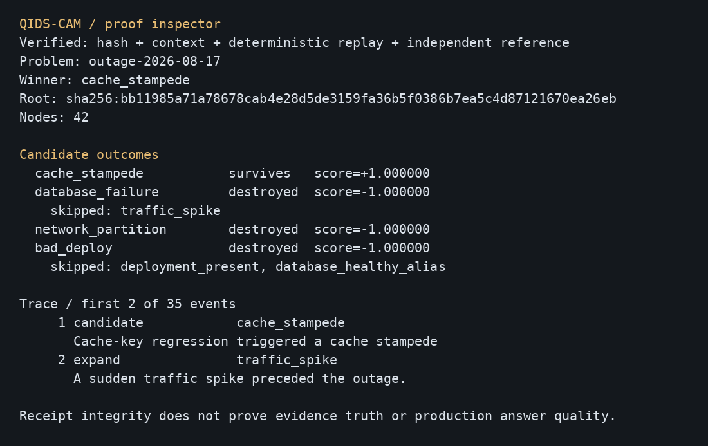

# QIDS-CAM

**Contradiction-aware graph search with content-addressed execution receipts.**

Evaluate a classical evidence graph, prune contradicted candidates, reuse exact
proposition content, and inspect what the solver actually did. Python 3.10+;
no runtime dependencies, model keys, network calls or background services.



## Why it exists

Different candidate explanations often depend on the same intermediate claims.
QIDS-CAM gives each proposition and its dependencies an exact content identity.
A resolved state can be reused; a destroyed state becomes a context-bound
no-good. Fatal local contradictions and destroyed dependencies eliminate their
candidate paths. A receipt retains the input, configuration, outcomes and trace.

This is a small research instrument for studying those mechanisms. The original
name expands to *Quantum-Inspired Destructive Search with Content-Addressed
Memory*. Its signed/phase scoring is classical arithmetic. There is no quantum
computation or quantum-speedup claim.

## First success, entirely offline

Repository: **[bohselecta/corgi-qidscam](https://github.com/bohselecta/corgi-qidscam)**.
Clone it once, then all computation and installation below work offline:

```sh
git clone https://github.com/bohselecta/corgi-qidscam.git
cd corgi-qidscam
```

From this checkout, with Python 3.10 or newer:

```sh
python3 -m qids_cam demo --archive proof.json
python3 -m qids_cam verify proof.json
python3 -m qids_cam inspect proof.json --limit 6
```

The synthetic outage fixture selects `cache_stampede`. Verification checks the
archive hashes, replays the execution and checks candidate outcomes against a
separately implemented reference evaluator. The inspector shows the actual
archived outcomes and trace. Linux/Python 3.12.14 was tested; other Python/OS
combinations have not been run in this release preparation.

For an installed command, the reviewed wheel is included in `wheels/`:

```sh
python3 -m venv .venv
.venv/bin/python -m pip install --no-index wheels/qids_cam-0.2.0-py3-none-any.whl
.venv/bin/qids-cam demo --archive proof.json
.venv/bin/qids-cam verify proof.json
```

On Windows, use `.venv\Scripts\python.exe` and
`.venv\Scripts\qids-cam.exe`; this path is documented but untested. Check the
wheel's SHA-256 against `wheels/SHA256SUMS` before installing it. Source builds
use setuptools >=77 and wheel; these are build tools, not runtime dependencies.

## Bring your own graph

```sh
python3 -m qids_cam solve examples/outage-investigation.json \
  --context examples/context.json --json run.json --archive proof.json
python3 -m qids_cam compare --problem examples/outage-investigation.json
python3 -m qids_cam inspect proof.json --json
```

A context records the exact policy/corpus/evaluator namespace for no-goods. It
does not alter evidence scores or apply constraint predicates. Each solve starts
with fresh caches; no unverified cross-session memory is imported.

The input contains evidence observations (`stance`, `confidence`, optional
`phase_degrees`), propositions (`evidence`, `depends_on`) and candidates
(`requires`, optional `prior`). Confidence is supplied weight, not a calibrated
probability. Cycles, unknown references, duplicate keys and nonfinite numbers
are rejected. Missing evidence contributes a neutral score. An `uncertain`
candidate can rank as winner: “winner” means best surviving score, not a verified
fact. If all candidates are destroyed, winner is `null`.

```python
from qids_cam import Problem, QIDSCAMSolver, verify_archive

problem = Problem.load("examples/outage-investigation.json")
result = QIDSCAMSolver().solve(problem, constraints={"policy": "demo-v1"})
archive = result.store.export_archive(result.proof_root)
report = verify_archive(archive)
print(report["winner"], report["root"])
```

The [fixed RAG adapter](examples/README.md) demonstrates the boundary between
retrieval labels and graph evaluation. It makes no model call and is not a real
corpus evaluation.

## Reproduce the experiment

```sh
python3 -m qids_cam benchmark --suite --json suite.json
python3 scripts/run_benchmarks.py
python3 -m unittest discover -s tests -v
python3 scripts/release_gate.py
```

The [v2 protocol](docs/RESEARCH-PROTOCOL-v2.md) fixes five synthetic workloads,
three seeds and seven configurations. [Full results](results/suite-v2.json)
retain every row. Counts below hold at each of seeds 7, 19 and 41:

| Workload | Simple recursive | Simple alias memo | Full QIDS-CAM |
| --- | ---: | ---: | ---: |
| High sharing | 3,584 | 88 | 51 |
| Low sharing | 128 | 128 | 95 |
| Low contradiction | 128 | 16 | 13 |
| Unique, no contradiction | 128 | 128 | 128 |
| Adverse hazard ordering | 128 | 128 | 128 |

All 105 case/configuration rows preserve candidate statuses, scores and winner;
repeated runs preserve deterministic work counts and proof roots. These counts
support a benefit from shared content and pruning on the declared fixtures.
They do not establish universal superiority.

**Unfavorable evidence:** the simple alias-memoized evaluator was faster than
full QIDS-CAM in every local diagnostic timing row. It omits hashing and receipt
work, a disclosed difference in work performed. Unique/adverse workloads show
no expansion reduction. The no-learning diagnostic matches the full solver's
expansion counts in every case: learned no-goods add no demonstrated work
reduction beyond memoizing destroyed states in these cold runs. Timing is one
measurement per row on one machine, not a statistical speed estimate.

A [later R&D pass](docs/RND-BACKLOG.md) is queued to test a new strategy under a
separate protocol. It will retain these results and may also produce negative or
inconclusive outcomes; no improvement is promised.

The source's frozen v0.1 protocol/results remain byte-identical in
[history](docs/history/RESEARCH_PROTOCOL.md) and `results/history/`. Version 0.2
fixes ablation semantics and missing-evidence handling, strengthens archive
verification, and produces new proof roots. Historical roots are hash-checkable
with `verify --hash-only`; they cannot establish v2 execution replay.

## Architecture and proof boundaries

`schema.py` validates the graph; `canonical.py` defines the JSON hash codec;
`solver.py` compiles CIDs and evaluates/prunes; `merkle.py` stores immutable
records; `proof.py` verifies/replays and inspects; `reference.py` provides the
separate recursive oracle. The CLI uses these same library interfaces.

See the [portable format](docs/PROOF-FORMAT.md), [current architecture](docs/ARCHITECTURE.md),
[acceptance record](docs/VALIDATION.md) and [prior art](docs/POSITIONING.md).
Merkle DAGs, memoization and conflict learning are established techniques;
novelty and real RAG gains remain open questions.

Archives retain supplied text and context in plaintext; publish only data you
intend to disclose. Hashes establish integrity relative to a chosen root,
not authorship, trust, or evidence truth. A self-consistent false archive requires
execution replay to detect inconsistent results. This is not a SAT proof system
or theorem prover. Float serialization uses the documented Python codec, not
IPLD/JCS; cross-language implementers must reproduce its test vectors. There is
no IPFS compatibility claim.

Input/output limits and resource budgets fail with CLI exit code 2. Outputs are
atomically replaced, and terminal control characters are escaped. Graph depth
is limited to 128; JSON to 64 MiB. Larger or adversarial production workloads
need an operator-enforced time/memory sandbox. No telemetry is collected.

## Contribute, cite and report issues

Read [CONTRIBUTING.md](CONTRIBUTING.md) and [SECURITY.md](SECURITY.md). Changes to
scoring, identity or experimental topology require a versioned protocol; retain
negative results. Release notes: [CHANGELOG.md](CHANGELOG.md).

Concept originated and directed by **Hayden Lindley**; prior authorship and
copyright are preserved in [AUTHORS.md](AUTHORS.md), [NOTICE](NOTICE) and
[CITATION.cff](CITATION.cff). Apache-2.0; [LICENSE](LICENSE).
Publisher: **[Corgi-verse Software](https://corgi-verse.com)**. The included wheel
is for offline installation; no package-registry upload or GitHub Release has
been made.
