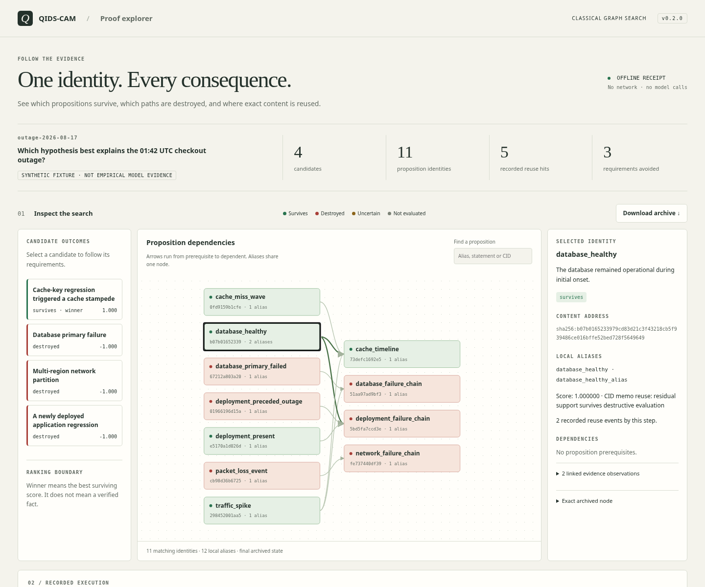

# Inspect the actual receipt

With Python 3.10+ in the checkout or installed package:

```sh
python3 -m qids_cam demo --archive proof.json
python3 -m qids_cam explore proof.json --output proof.html
```

Open `proof.html` in a browser. It is self-contained and computes offline.
Use a local file server only if your managed browser blocks opening local files.
No hosted demo, private repository, Node installation or model key is needed.



1. Select a candidate. Its required propositions and prerequisites stay visible;
   other paths dim. The caption reports evaluated and skipped requirements from
   the final receipt. Select it again to see all paths.
2. Select a graph node with the mouse, or Tab to it and press Enter. Local aliases
   collapse onto one content identity. Inspect linked evidence, its supplied
   weights/source, dependencies and the exact archived payload.
3. Move the trace slider with mouse or keyboard, or use Previous/Next. The graph
   shows only statuses recorded by that step. Filter reuse/destruction events or
   select an event to navigate directly to its node. Final state restores the end.
4. Inspect context and configuration. No-good and memo hit counts come from the
   receipt, not an inferred performance improvement. The default outage has no
   no-good hits; the frozen high-sharing example does.
5. Download the embedded JSON and run `python3 -m qids_cam verify proof.json`.
   Compare its proof root with a root you trust.

Prepared examples can be opened directly after cloning:

- `docs/explorer.html`: synthetic outage, 4 candidates, 11 proposition identities.
- `docs/reuse-explorer.html`: frozen high-sharing/seed-7 workload from the v2
  suite. It demonstrates actual no-good hits and the extra expansion costs of
  the larger instrument; it is synthetic evidence.

Regenerate with `python3 scripts/export_examples.py`. Your own v2 archive can be
exported with the same `explore` command. Invalid or tampered data fails before
replacing the output. Exports are limited to 5000 archive nodes / 20000 trace
events; larger data remains inspectable through the CLI.

Verification happens in Python before export: hashes/links, deterministic replay,
then independent reference outcome checking. HTML is a view of that result; a
modified HTML could lie. The browser does not reimplement Python's hash codec.
Archive downloads preserve its `1.0`/`1` distinction. Neither hashes nor replay
prove evidence truth, authorship, calibrated confidence or general superiority.

Archive evidence/context are plaintext. Sharing HTML discloses the same material.
There are no remote assets, requests, analytics or automatic uploads. Untrusted
strings are rendered as text with control/bidi characters escaped.
